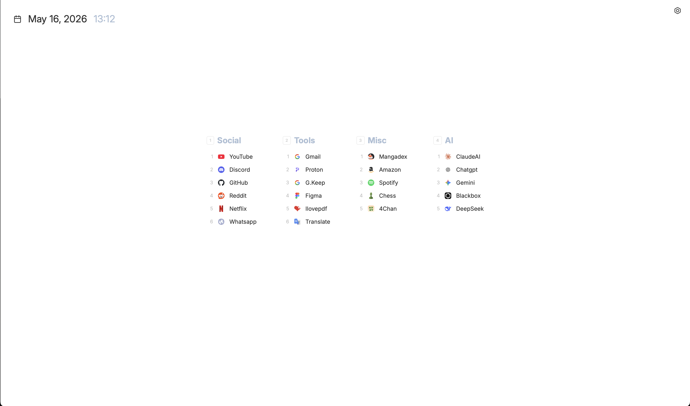
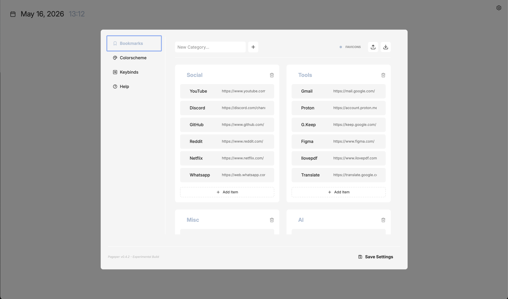
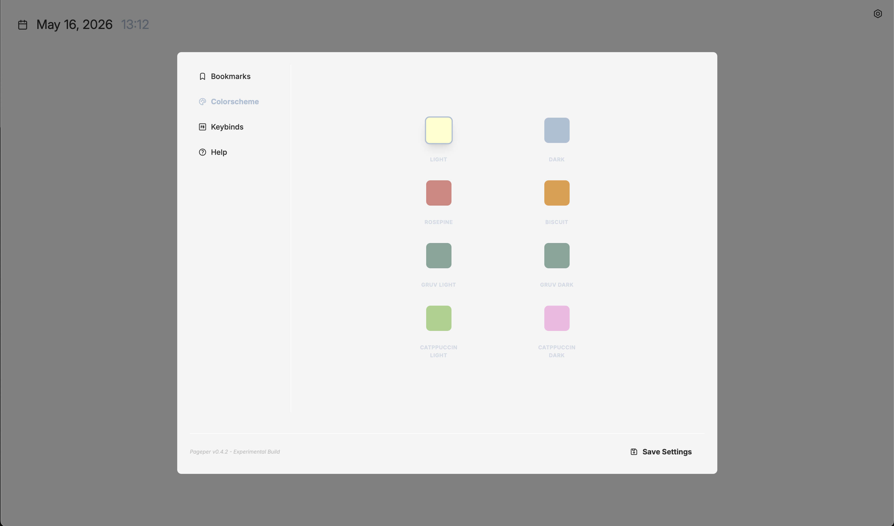
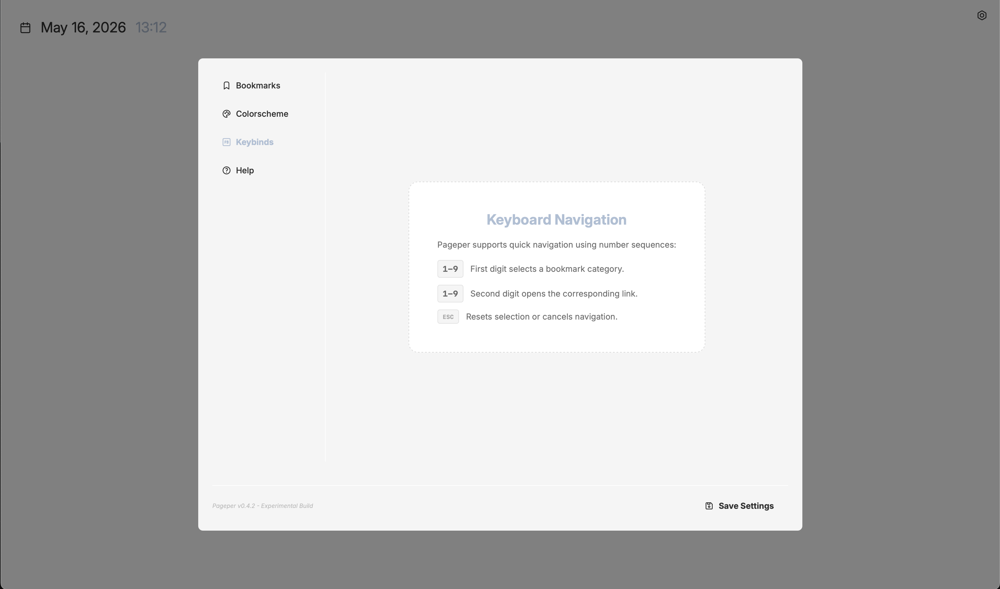
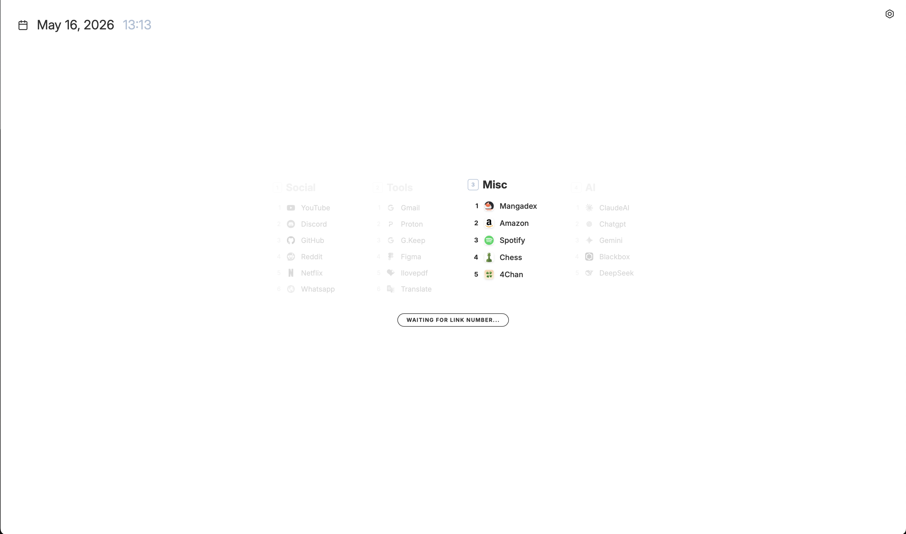

# 📰 Pageper

**Pageper** is a minimalist focused **startpage** that aims to be as **simple** and customizable **as possible**. 
This Project was born from the need to create a **less saturated start page**. 

    <i>Figure i: home screen</i>

 

### The problem? 
Modern startpages ship with irrelevant news, intrusive ads, and unsolicited recommendations. 
This "bloatware" ecosystem turns a practical tool that should not take too much cognitive load to manage into a panel of distractions.
Sometimes those developers dare more and try to implemment cloud based features, like saving your bookmarks under an account you create 
to manage your bookmarks. This is friction and innecesary infrastructure for one only purpose, not to mention the privacy issues and latency it might exist.
 

This type of tools are meant to be lightweight and operate with the least friction possible between intention and execution. 
Pageper tries actively to mititgate all of the previous problems listed above.
  

### Why Pageper?
- Zero bloat: no news, no ads, no widgets you didn't ask for.
- Private by default: no account, no telemetry, no cloud sync. 
  Everything stays in your browser. (Favicons fetched via DuckDuckGo.)
- Keyboard-first: open any bookmark with a keystroke. No mouse required.
- Themes: eight colorschemes, saved locally.
   

## 🌐 Installation

### Through Firefox Extensions.  
**This is the recommended way** of installation. 
* https://addons.mozilla.org/en-US/firefox/addon/pageper/
  

### From source with node package manager (npm) or bun.js (bun). 
I made a Markdown file for building from source. 
* [Building instructions from source and requisites](/BuildFromSource.md)

Or you can run the auto-build script that atomate this whole process. 
* [Auto build script](/build.sh)

    
  

## 📖 Get started!
Click the settings button in the top right corner to open the configurations window.
You can find in the left side some sections:
- Bookmarks: here you can add, remove, modify and organize your bookmarks.
- Themes: Eight colorschemes to choose from.
- Keyboard: how the keyboard navigation works.
- Help: if you have extra questions it will redirect to this repository to contact me.

  <table>
    <tr>
        <td></td>
        <td></td>
    </tr>
    <tr>
        <td></td>
        <td></td>
    </tr>
  </table>
  <i>Figures ii - v: Available Configurations</i>

 

## 🚫 Got a error?
Open a issue or discution in this repository (: 
If its possible, add the output log of the console from `Inspect(Q) -> Console`.  
I am trying to be as active as i can.  

## ⚠️ Disclaimer
Pageper fetches site icons exclusively through DuckDuckGo's favicon service. No other external requests are made — your bookmarks, settings, and preferences are stored locally in your browser and never leave your device.  
